# 📚 Library Management System (LMS) - Complete Project Details

This document contains a comprehensive breakdown of the styled, secure, and unified **Library Management System** codebase. You can use this complete specification to share with **Google Gemini** or any developer for project context, extensions, or future features.

---

## 🔗 1. System Navigation & Local URLs

Once your local XAMPP server (Apache & MySQL) is running, you can access the system modules using the following links:

*   **Main Entrance / Home Redirect**: [http://localhost/library_project/](http://localhost/library_project/)
    *   *Automatically redirects to `dashboard.php` if logged in, or `login.php` if guest.*
*   **Member Login Gateway**: [http://localhost/library_project/login.php](http://localhost/library_project/login.php)
*   **Member Registration Portal**: [http://localhost/library_project/register.php](http://localhost/library_project/register.php)
*   **System Admin Dashboard**: [http://localhost/library_project/dashboard.php](http://localhost/library_project/dashboard.php)
*   **Book Catalog Stock**: [http://localhost/library_project/view_books.php](http://localhost/library_project/view_books.php)
*   **Add New Book**: [http://localhost/library_project/add_book.php](http://localhost/library_project/add_book.php)
*   **Issue a Book Transaction**: [http://localhost/library_project/issue_book.php](http://localhost/library_project/issue_book.php)
*   **Return a Book Transaction**: [http://localhost/library_project/return_book.php](http://localhost/library_project/return_book.php)
*   **Database Connectivity Test Utility**: [http://localhost/library_project/test.php](http://localhost/library_project/test.php)
*   **Logout Session Terminate**: [http://localhost/library_project/logout.php](http://localhost/library_project/logout.php)

---

## 📂 2. File & Inclusion Architecture Diagram

The diagram below visualizes how the different files in the system are linked together through standard PHP `include` calls, creating a cohesive, reusable, and modern structure:

```mermaid
graph TD
    index.php[index.php <br> root entry] -->|redirects to| dashboard.php
    index.php -->|redirects to| login.php

    login.php[login.php <br> member login] -->|includes| db.php
    register.php[register.php <br> account signup] -->|includes| db.php

    dashboard.php[dashboard.php <br> admin control board] -->|includes| auth.php
    dashboard.php -->|includes| db.php
    dashboard.php -->|includes| header.php
    dashboard.php -->|includes| sidebar.php

    add_book.php[add_book.php <br> register book] -->|includes| auth.php
    add_book.php -->|includes| db.php
    add_book.php -->|includes| header.php
    add_book.php -->|includes| sidebar.php

    view_books.php[view_books.php <br> stock catalog] -->|includes| auth.php
    view_books.php -->|includes| db.php
    view_books.php -->|includes| header.php
    view_books.php -->|includes| sidebar.php

    issue_book.php[issue_book.php <br> record borrow] -->|includes| auth.php
    issue_book.php -->|includes| db.php
    issue_book.php -->|includes| header.php
    issue_book.php -->|includes| sidebar.php

    return_book.php[return_book.php <br> restock return] -->|includes| auth.php
    return_book.php -->|includes| db.php
    return_book.php -->|includes| header.php
    return_book.php -->|includes| sidebar.php

    edit_book.php[edit_book.php <br> modify catalog] -->|includes| auth.php
    edit_book.php -->|includes| db.php
    edit_book.php -->|includes| header.php
    edit_book.php -->|includes| sidebar.php

    classDef core fill:#ffc107,stroke:#333,stroke-width:2px,color:#000;
    classDef utility fill:#f1f1f1,stroke:#666,stroke-width:1px,color:#333;
    class db.php,auth.php,header.php,sidebar.php core;
```



---

## 📄 3. Detailed Index of System Files

Here is a comprehensive breakdown of the purpose and internal inclusions of every file in the codebase:

### ⚙️ Core Configuration & Utilities

#### 1. `db.php`
*   **Purpose**: Manages global database connectivity using the `mysqli` driver.
*   **Configuration**: Set to connect to `127.0.0.1` on custom MySQL port `3307` with username `root`, empty password, and database `library1`.
*   **Code Example**:
    ```php
    $conn = new mysqli("127.0.0.1", "root", "", "library1", 3307);
    ```

#### 2. `auth.php`
*   **Purpose**: Initiates the session checking. (Authentication checks can be enabled here globally to secure all backend pages).
*   **Included by**: All interior pages.

#### 3. `header.php`
*   **Purpose**: Renders the top navigation brand banner (`Library Management System` logo, Admin badge, and active links).
*   **Inclusions**: Starts sessions safely if not already initialized.

#### 4. `sidebar.php`
*   **Purpose**: A unified sidebar navigation panel featuring custom iconography (`📊 Dashboard`, `➕ Add New Book`, `📚 View Book Inventory`, etc.) with responsive hover effects.
*   **Inclusions**: Automatically included on all interior pages to guarantee modularity.

---

### 🔑 Authentication Gateways

#### 5. `index.php`
*   **Purpose**: Acts as the project entry index.
*   **Logic**: Automatically checks session status and instantly redirects user to the dashboard or login page.

#### 6. `login.php`
*   **Purpose**: Provides a beautifully centered glassmorphism box for system administrators and members to sign in.
*   **Logic**: Employs secure, injection-safe SQL prepared statements. Redirects to `dashboard.php` upon success.

#### 7. `register.php`
*   **Purpose**: High-end registration portal matching the login visual style.
*   **Logic**: Validates duplicate usernames/emails, creates new users securely using prepared statements, and redirects to `login.php` after a 1.5s delay.

---

### 📊 Administrative Modules (Layout-Consistent)

#### 8. `dashboard.php`
*   **Purpose**: The central analytics hub.
*   **Design**: Incorporates the library shelf background image (`wp10902817.jpg`), shared sidebar, and grid of translucent colored cards:
    *   **Members Count** (Cyan)
    *   **Issued Books Count** (Green)
    *   **Total Books Count** (Red)
    *   **Pending Fines** (Orange)

#### 9. `view_books.php`
*   **Purpose**: Complete digital catalogue listing all books in inventory.
*   **Design**: Displays a translucent high-end table with dynamic status badges (`In Stock` / `Out of Stock`) and active action triggers.

#### 10. `add_book.php`
*   **Purpose**: Allows registration of new books into database.
*   **Logic**: Generates total quantity and matches it automatically with available quantity on insert. Fully styled.

#### 11. `edit_book.php`
*   **Purpose**: Metadata editor for changing catalog listings.
*   **Logic**: Computes the difference when modifying total quantity to adjust available inventory counts safely.

#### 12. `delete_book.php`
*   **Purpose**: Removes an inventory book listing securely.

#### 13. `issue_book.php`
*   **Purpose**: Processes book lending transactions.
*   **Logic**: Checks that the member ID and book ID exist and are valid, ensures there is stock available, saves borrow records, and decrements book inventory availability automatically.

#### 14. `return_book.php`
*   **Purpose**: Performs book return restocks.
*   **Logic**: Checks that the issue ID is valid, changes status, updates return timestamps, and increments book availability inventory counts automatically.

---

### 🎨 Design System Assets

#### 15. `style.css`
*   **Purpose**: Controls global typography (Segoe UI, Arial), body layouts, generic cards, buttons, custom scrollbars, table borders, and loads the active background image:
    ```css
    body {
        min-height: 100vh;
        background: url('wp10902817.jpg') no-repeat center center fixed;
        background-size: cover;
    }
    ```

#### 16. `script.js`
*   **Purpose**: Handles global visual transitions, popups, and click interactions.
*   **Safety Features**: Employs robust element-existence validation checks before registering click event handlers, preventing `TypeError` runtime crashes.
